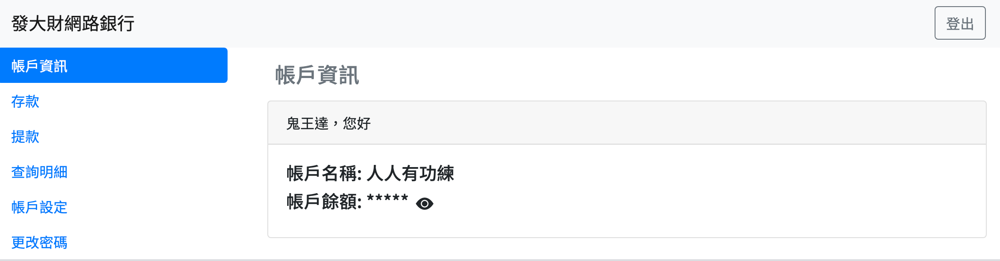

# RD5_Assignment: 線上網銀系統

## 使用説明
1. 將此資料夾放到網站伺服器根目錄底下
2. 根據資料庫設定修改"cores/config.php"的內容dbuser 帳號, dbpass 密碼, dbhost 域名, dbport port
3. 將dbscript/script.txt的SQL語句拿到SQL commndline或phpmyadmin執行
4. 下載composer，輸入指令: composer dump-autoload 
5. 打開瀏覽器並輸入localhost/RD5_Assignment

## 專案說明

1. 所需功能
    * 登入/註冊
    * 存款
    * 提款
    * 查詢餘額
    * 查詢明細
2. 使用者介面
    * 介面需顯示餘額, 排版可自由發揮 (可設定使用 * 屏蔽餘額)
    * 需有第一點列出之功能

## 專案資料夾結構
```
.
├── README.md
├── composer.json  -- composer autoload 設定
├── controllers    -- 控制器
│   ├── DashboardController.php   -- 負責處理使用者操作介面後端邏輯
│   ├── HomeController.php        -- 負責處理首頁後端邏輯
│   └── TransactionController.php -- 負責處理交易紀錄的後端邏輯
├── cores -- 專案使用的基本函式庫
│   ├── Model.php      -- 物件映射模型
│   ├── app.php        -- 創建出APP物件，負責決定使用哪一個控制器處理請求
│   ├── config.php     -- 專案的一些基本設定
│   ├── controller.php -- 控制器類別
│   ├── database.php   -- 方便取得並創造PDO資料庫物件的類別
│   └── route.php      -- 可以獲取並操作路徑的類別
├── dbscript
│   └── script.txt     -- SQL腳本
├── demo               -- github展示用圖片
├── models -- 模型 負責與資料庫溝通
│   ├── Account.php          -- 帳戶資料表
│   ├── Action.php           -- 交易動作
│   ├── Transaction.php      -- 交易資料表
│   └── TransactionError.php -- 錯誤訊息資料表
├── tests -- 一些測試用程式碼
└── views -- 視圖
    ├── api
    │   ├── JsonAPI.php     -- 輸出Json格式的API
    │   └── JsonArrAPI.php  -- 將陣列資料輸出Json格式的API
    ├── body
    │   ├── dashboardContent.php  -- 使用者操作介面body
    │   └── homeContent.php       -- 首頁body
    ├── footer                    -- 網頁 footer
    │   └── default.php
    ├── header                    -- 網頁 header
    │   └── default.php
    ├── dashboard.php             -- 使用者操作介面
    ├── home.php                  -- 首頁
    ├── panel                     -- 使用者操作介面面板(使用Ajax動態更新介面時使用)
    │   ├── accountInfo.php         -- 帳戶資訊
    │   ├── actionForm.php          -- 存/提款表單
    │   ├── changePasswordForm.php  -- 更改密碼表單
    │   ├── changeResult.php        -- 更改結果畫面
    │   ├── settingForm.php         -- 帳戶設定表單
    │   ├── transactionDetail.php   -- 交易細節
    │   ├── transactionTable.php    -- 交易明細報表畫面
    │   └── validateForm.php        -- 驗證身份表單
    ├── script -- 前端腳本
    │   ├── accountInfo.js     -- 帳戶資訊面板腳本
    │   ├── action.js          -- 存/提款表單面板腳本
    │   ├── changePassword.js  -- 更改密碼表單面板腳本
    │   ├── continue.js        -- 繼續操作畫面腳本
    │   ├── dashboard.js       -- 使用者操作介面腳本
    │   ├── home.js            -- 首頁腳本
    │   ├── settingForm.js     -- 帳戶設定面板腳本
    │   ├── simple-bootstrap-paginator-master -- 換頁按鈕函式庫
    │   ├── transactionTable.js  -- 查詢交易明細面板腳本
    │   └── validate.js          -- 驗證表單面板腳本
    └── css
        └── custom.css           -- 專案客製化樣式表
```

## 系統架構


## 資料庫實體關係圖


## 使用第三方套件

[Simple Boostrap Pagination Plugin With jQuery](https://www.jqueryscript.net/other/Simple-Boostrap-Pagination-Plugin-With-jQuery.html)
## 實作成果
網站首頁


註冊


註冊成功


登入


帳戶資訊顯示餘額


存款


存款交易明細


提款


提款交易明細


查詢明細前驗證


查詢明細


點選查看交易明細


帳戶設定前驗證


帳戶設定


更改密碼


帳戶餘額屏蔽功能
